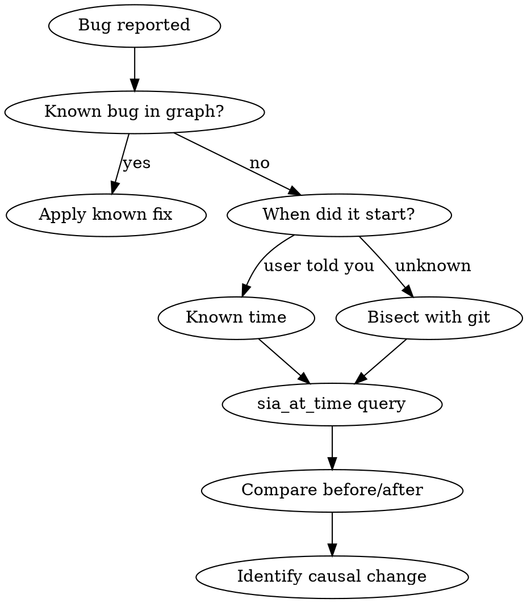

# Temporal Investigation with sia_at_time

SIA's temporal queries let you ask "what was true before this broke?" — the fastest path to root cause for regressions.

## When to Use



## Choosing the Right Timestamp

| Scenario | Timestamp Strategy |
|---|---|
| "It broke last week" | Use `as_of` = last Monday midnight |
| "It broke after deploy X" | Use `as_of` = deploy timestamp from git tag |
| "It was working in v2.1" | Use `as_of` = v2.1 release date |
| "Not sure when" | Use git bisect first, then `sia_at_time` on the identified commit date |

## The Query Pattern

**Step 1 — Snapshot before the bug:**

```
sia_at_time({ as_of: "<before_bug>", entity_types: ["Decision", "Convention", "Bug", "Solution"] })
```

**Step 2 — Compare with current state:**

```
sia_search({ query: "<affected area>", task_type: "bug-fix", limit: 20 })
```

**Step 3 — Identify the delta:**

Look for:
- **New Decision entities** that appeared after `as_of` — these are changes that coincide with the bug
- **Invalidated entities** (`t_valid_until` set) — something was intentionally changed
- **New Bug entities** in the same area — related issues that may share a root cause

## Interpreting Results

**Strong signal:** A Decision entity was created near the bug's introduction date that modified the affected module. This is likely causal.

**Weak signal:** Only Convention changes in the timeframe. Conventions rarely cause bugs — look deeper.

**No signal:** The graph has no entities near the timestamp. Fall back to git log analysis and `sia_by_file` for structural investigation.

## Common Pitfalls

| Pitfall | Fix |
|---|---|
| Querying too narrow a window | Widen by 2x — bugs often manifest days after the causal change |
| Ignoring `t_valid_until` entities | These are CHANGES — exactly what you're looking for |
| Trusting Tier 3 timestamps blindly | Tier 3 entities have `t_valid_from = null` sometimes — verify against git |
| Skipping `sia_by_file` after temporal | Always check the affected file's current graph state too |

## Red Flags

- **3+ temporal queries with no signal** → The bug predates the graph. Switch to pure git investigation.
- **Conflicting temporal data** → Check for `conflict_group_id` on results. Resolve conflicts before debugging.
- **Bug reintroduced** → Same Bug entity appears, gets fixed (Solution), then reappears. This is a systemic issue — surface to developer.
